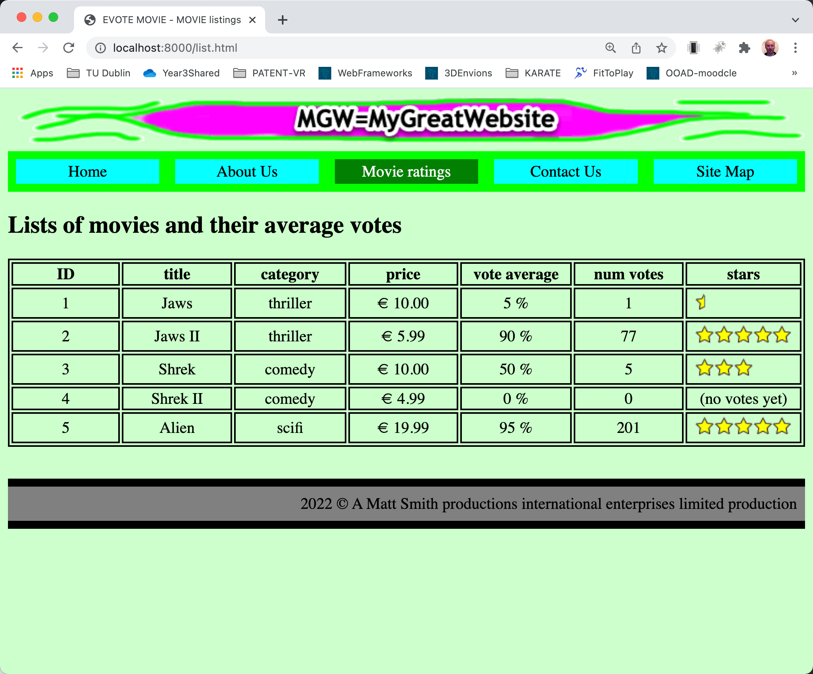

# evote-movie-2022

## About
This is a sequence of progressive enhancements, taking a static HTML site into an authenticated modern PHP MVC website

The website is about movies and user voted stars.

## An OO-PHP first approach

DB-drive websites in PHP are much simpler when programming in Object-Oriented PHP, so that's the approach taken here.
If you've not programmed with an OO language before, you may wish to first work through the 2019 version of this case study:

[https://github.com/dr-matt-smith/evote-movie-2019](https://github.com/dr-matt-smith/evote-movie-2019)

## Progressive enhancement

1. Starting point
    - a flat HTML website with hardcoded links

    - https://github.com/dr-matt-smith/evote-movie-2022-01-basic-html

2. Change HTML to PHP
    - change all `.html` file extensions to `.php`
    - in every page change the navigation links to files ending with `.php`

    - https://github.com/dr-matt-smith/evote-movie-2022-02-all-files-dot-php

3. Add Front Controller PHP OO architecture
   - move all display pages into folder `/templates`    
     - (keep) images and css in folder `/public`
   - create `src` folder (for all our class files)
   - create PHP class `/src/MainController.php` class with methods to display each of the page templates
   - create `composer.json` to define PHP namespaced `Tudublin` classes in `/src`:
   - at the terminal command line run `composer dump-autoload` to create a `/vendor` folder and containing autoloading script `autoload.php`
   - add root website script `/public/index.php` to run the autoload,  create an `Application` object and invoke its `run()` method:
   - in the `/templates` folder change **all** navigation links in the HTML content to the form `/?action=<PAGE>`. This means that **EVERY** request goes through `/public/incdexphp` and our application's switch-statement in `Application::run()`

     - e.g. `/?action=about` for link to about page

     - e.g. `/?action=sitemap` for link to sitemap page
   
   - create class `/src/Application.php` with a `run()`  method to test for value of `GET` variable `action`, create a `$mainController` object, and invoke the `MainController` method that corresponds to the value found for `action` in the URL
   
   - https://github.com/dr-matt-smith/evote-movie-2022-03-front-controller

4. Separate header and foot page content in part-page templates that can be re-used

   - create `/templates/_header.php` containing HTML header and nav content
   - create `/templates/__footer.php` containing HTML footer content
   - update each page to remove duplicated code, set a `$pageTitle` variable, and require-in the header and footer templates

   - https://github.com/dr-matt-smith/evote-movie-2022-04-header-footer-templates

5. List details from array of `Movie` objects

   - declare a PHP class `/src/Movie.php` for data about movie objects
   - add to class `Movie` a method `getStarImage()` which returns a star image name, based on the vote averge:

   - update the `list()` method of class `MainController` to create and pass an array of `Movie` objects to the movie list template

   - update the movie list template (`/templates/list.php`) to loop through an array of `Movie` objects to create the movies table

   - edit the movie list template `/templates/list.php` to loop through the array `movies`, using the getter values,a dnte star image method, to populate each table row:

   - https://github.com/dr-matt-smith/evote-movie-2022-05-movie-class-loop

    - https://github.com/dr-matt-smith/evote-movie-2022-23-sticky-form-validation

24. Example of Codeception automated acceptance testing (simulating users clicking links and submitting forms):

    - https://github.com/dr-matt-smith/evote-movie-2022-24-codeception-testing

25. Single master script to run all the DB migrations and fixtures

    - https://github.com/dr-matt-smith/evote-movie-2022-25-single-reset-db-script

26. Associate Comment with logged-in user (if a user *was* logged-in) (one-to-one association)

    - https://github.com/dr-matt-smith/evote-movie-2022-26-comment-user-association

27. Movie-Category Many-to-one association

    - https://github.com/dr-matt-smith/evote-movie-2022-27-movie-category-many-to-one

5. Added Twig library to the project and converted page templates

    - use Composer to add `twig/twig` library to project
    - add a Twig object in `MainController` constructor
    - rename all files in `/templates` folder in form `<PAGE>.html.twig`
    - update `MainController` methods to use `Twig` object to create and print HTML for each template

    - https://github.com/dr-matt-smith/evote-movie-2022-04-twig-templates

6. Twig master page template and child-page inheritance
    - move all common header and nav and footer content to `/templates/_base.html.twig`
    - define overridable head `title` Twig block in base template
    - define overridable `main` Twig block in base template
    - make all other template pages extend base and override `main` Twig block

    - NOTE: we have lost and current page nav indicator - we'll fix this soon :-)

    - https://github.com/dr-matt-smith/evote-movie-2022-05-twig-base-template-inheritance

7. Use Twig blocks for CSS style to indicate current page indicated in nav bar CSS

    - controller functions to pass values

    - https://github.com/dr-matt-smith/evote-movie-2022-06-twig-current-page-block

28. Gitpod (online editor - virtual Linux machine with MySQL)

    - https://github.com/dr-matt-smith/evote-movie-2022-28-gitpod

29. current attempt to get working in Github **Codespaces** online virtual machine (work in progress)

    - https://github.com/dr-matt-smith/evote-movie-2022-29-github-codespaces-attempt

## Steps todo ...

- List CHEAP movies - custom SQL method in Repository class

- Movie Charts - DB Many-to-many relationship

