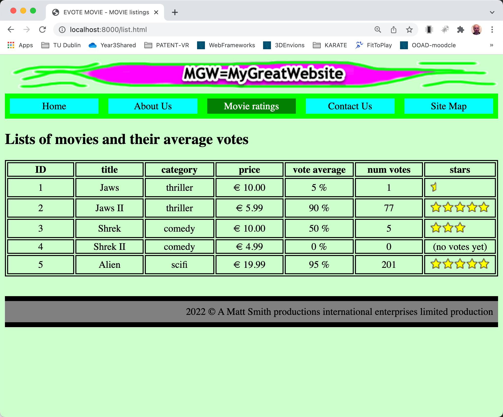

# evote-movie-2022

## About
This is a sequence of progressive enhancements, taking a static HTML site into an authenticated modern PHP MVC website

The website is about movies and user voted stars.

## An OO-PHP first approach

DB-drive websites in PHP are much simpler when programming in Object-Oriented PHP, so that's the approach taken here.
If you've not programmed with an OO language before, you may wish to first work through the 2019 version of this case study:

[https://github.com/dr-matt-smith/evote-movie-2019](https://github.com/dr-matt-smith/evote-movie-2019)

## Progressive enhancement

1. Starting point
    - a flat HTML website with hardcoded links

    - https://github.com/dr-matt-smith/evote-movie-2022-01-basic-html

2. Change HTML to PHP
    - change all `.html` file extensions to `.php`
    - in every page change the navigation links to files ending with `.php`

    - https://github.com/dr-matt-smith/evote-movie-2022-02-all-files-dot-php

3. Add Front Controller PHP OO architecture
   - move all display pages into folder `/templates`    
     - (keep) images and css in folder `/public`
   - create `src` folder (for all our class files)
   - create PHP class `/src/MainController.php` class with methods to display each of the page templates
   - create `composer.json` to define PHP namespaced `Tudublin` classes in `/src`:
   - at the terminal command line run `composer dump-autoload` to create a `/vendor` folder and containing autoloading script `autoload.php`
   - add root website script `/public/index.php` to run the autoload,  create an `Application` object and invoke its `run()` method:
   - in the `/templates` folder change **all** navigation links in the HTML content to the form `/?action=<PAGE>`. This means that **EVERY** request goes through `/public/incdexphp` and our application's switch-statement in `Application::run()`

     - e.g. `/?action=about` for link to about page

     - e.g. `/?action=sitemap` for link to sitemap page
   
   - create class `/src/Application.php` with a `run()`  method to test for value of `GET` variable `action`, create a `$mainController` object, and invoke the `MainController` method that corresponds to the value found for `action` in the URL
   
   - https://github.com/dr-matt-smith/evote-movie-2022-03-front-controller

4. Separate header and foot page content in part-page templates that can be re-used

   - create `/templates/_header.php` containing HTML header and nav content
   - create `/templates/__footer.php` containing HTML footer content
   - update each page to remove duplicated code, set a `$pageTitle` variable, and require-in the header and footer templates

   - https://github.com/dr-matt-smith/evote-movie-2022-04-header-footer-templates

5. List details from array of `Movie` objects

   - declare a PHP class `/src/Movie.php` for data about movie objects
   - add to class `Movie` a method `getStarImage()` which returns a star image name, based on the vote averge:

   - update the movie list template (`/templates/list.php`) to loop through an array of `Movie` objects to create the movies table

   - create a new class `/src/MovieFixtures.php` that declares a single method `getObjectArray()`. This method creates some `Movie` objects, and returns an array containing these objects.

   - update the `list()` method of class `MainController` to get the array of objects from a `MovieFixtures` instance, and pass that array of `Movie` objects to the movie list template
       
   - https://github.com/dr-matt-smith/evote-movie-2022-05-movie-class-loop

6. Add PDO DB library and get Movies from database table

   - add library `pdo-crud-for-free-repositories` to the project using Composer:

   - create a file `.env` containing your MySQL database credentials, for example:

   - create a new class `/src/MovieRepository.php` and make this empty class inherit from ` Mattsmithdev\PdoCrudRepo\DatabaseTableRepository`:

   - create a new directory `/dbsetup`, containing file `migrationsAndFixtures.php` to create/reset a DB table `movie`, then get the array of `Movie` objects from a `MovieFixtures` object, and insert all those objects into the database

   - at the command line, execute PHP script `/dbsetup/migrationAndFixtures.php`. If no schema matching the name in your `.env` file exists, then a new schema of the specified name will be created, and a messasge displayed to confirm this action:

   - refactor the `list()` method of class `MainController` to create a repository object, and dynamically retrieve all `Movie` objects from the MySQL database:
  
   - https://github.com/dr-matt-smith/evote-movie-2022-06-movie-db-table

